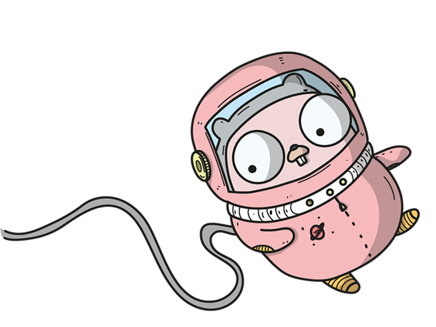

# KubeOps




- A kubernetes Operator built in go and leveraging `Kind` for speedy local development.
- Utilises golang to express your operator requirements not some DSL or CRD system.

### Development perks

- Uses a local registry to build a golang project then push into the k8s cluster directly
- Example of using k8s golang API
- Example of using helm

## Requirements

|   |
|---|
| Kind  |   
| Golang |  
| Docker |
| Helm |  


## Install something and get it running

`make up`

`make`

These commands should be enough to create the kind cluster and install `kubeops`


## Commands

|   |   |
|---|---|
| make up  | Creates a kind cluster   |
| make down | Deletes the kind cluster  |
| make | Builds the project, dockerfile, side loads then installs into the cluster |
| make delete | Deletes all currently installed helm releases  |

## Development without having to push an image

`go run main.go --context kind-kind `

Allows you to connect using the local kubeconfig to the cluster and operate externally.

## Development and pushing to the cluster

1. `<write some code> `

2. Test with the above (`go run main.go --context kind-kind `)

3. `make`

4. View your changes in the cluster

# Development

You will see in the code `operators` defines how we filter and act on events

```go
func (ExamplePodOperator) WithFilter() interface{} {

	return &v1.Pod{}
}

func (ExamplePodOperator) OnEvent(msg subscription.Message) {

	log.Debug("Pod event ----> %v", msg.Event)
}
```
This example struct adheres to the `ISubscription` interface.

Once you've created the operator add it into the main.go

```go

  registry := &subscription.Registry{
    Subscriptions: []subscription.ISubscription{
      operators.ExamplePodOperator{},

    },
  }
```

That's it - now you will get filtered watch events for your type (Providing they are in the `lib/watcher` GenerateWatchers channel setup.)
