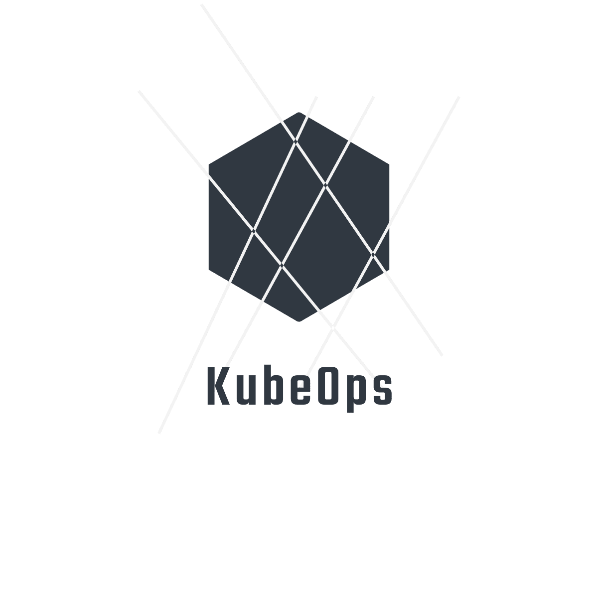
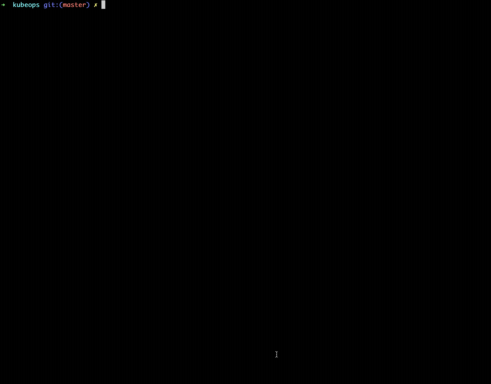
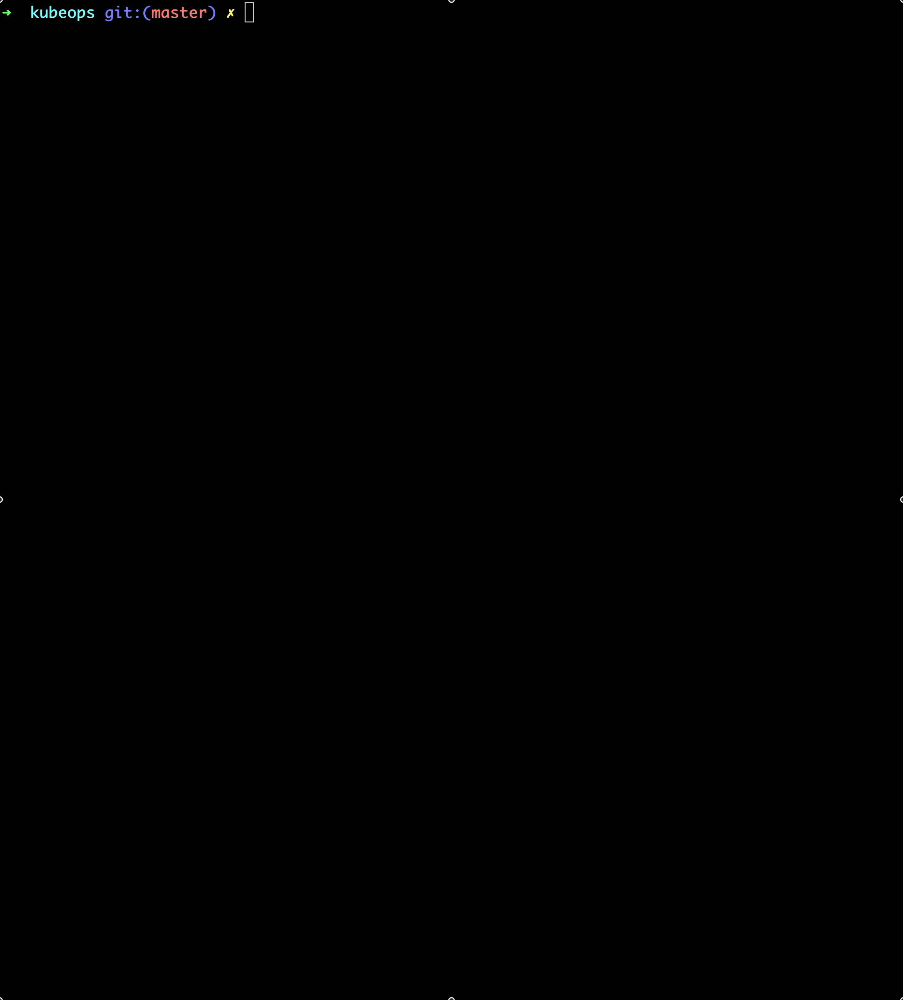

Simple programmatic Kubernetes Operator template.

Use this to create your own Kubernetes operators with golang.

- Build with KIND (Kubernetes in Docker)
- Express custom behaviours in code - no DSL to learn.

## Run the example...

Run locally:

- `make up` to start a K.I.N.D cluster on Docker.
- `go run main.go --context=~/.kube/config`

_This gif is an example of running kubeops locally on the host machine and scaling some arbitrary deployment to show the watcher/subscription system_

Build docker image and install into cluster locally:

- `make`

_Please see [REQUIREMENTS.md](REQUIREMENTS.md) for installation requirements_

_Please see [LICENCE.md](LICENCE.md) for licence enquiries_

### Development perks

- A simple golang based implementation of an Operator with the boiler plate done.
- Has a pre-made helm chart, so you can build an image of this code and push it into a cluster with your changes.
- Example of using k8s golang API
- Example of using helm

## Commands

|   |   |
|---|---|
| make up  | Creates a kind cluster   |
| make down | Deletes the kind cluster  |
| make | Builds the project, dockerfile, side loads then installs into the cluster |
| make delete | Deletes all currently installed helm releases  |

## Suggested development workflow

1. `<write some code> `

2. Test with the above (`go run main.go --context kind-kind `)

3. `make`

4. View your changes in the cluster

## How does it work in a nutshell?

- Kubeops uses the go-client for Kubernetes and leverages the watch capability.

- The value of this project is wrapping those calls in interfaces and creating some utility functionality for cluster connection.

- More information on how to develop your own operator watchers/subscriptions can be found [here](DEVELOPMENT.md).