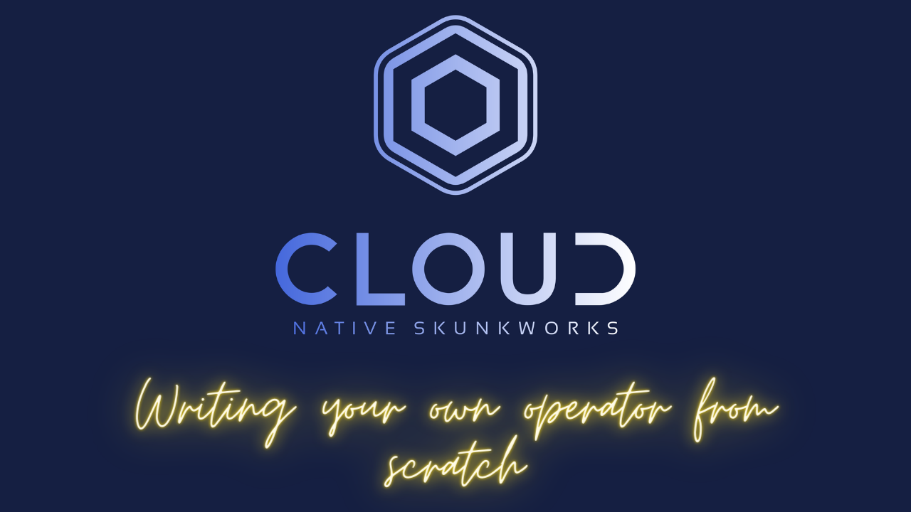
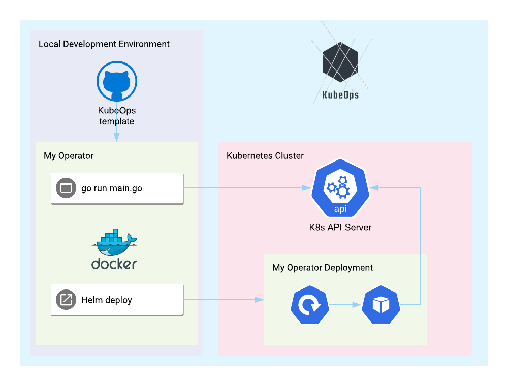

[](https://youtu.be/08O9eLJGQRM "Operators")

### This project is now located within the CloudNative Skunkworks [here](https://github.com/cloud-native-skunkworks/KubeOps) this repository will maintain a mirror.


A simple programmatic Kubernetes Operator template.

Use this to create your own Kubernetes operators with golang.

- Build with KIND (Kubernetes in Docker).
- Express custom behaviours in code - no DSL to learn.
- Generate your CRD's with controller-runtime and import them here.
- Works with built-in kubernetes resource types and custom resource definitions ( example included ).
- Works with Kubebuilder to write your own custom resource definitions, install them and operate with them.
- [SlackAlerter](https://github.com/AlexsJones/slackalerter) is a complete example using this template.

## Use this project template
- Click the `Use this template` button.
- Open your new repo...
- Voila 💅🏼


## Run the example... 🥰

Run builtin examples locally:

- `make up` to start a K.I.N.D cluster on Docker.
- `make run-builtin-example`

This creates some resource interfaces and subscribes to them with some basic subscriptions `./subscriptions`

```
go run examples/builtin/main.go --kubeconfig=/Users/jonesax/.kube/config
I1111 16:03:11.903734   59945 main.go:51] Starting @ 2020-11-11 16:03:11.903596 +0000 GMT m=+0.008013710
I1111 16:03:11.903757   59945 main.go:52] Got watcher client...
I1111 16:03:11.944279   59945 exampledeploymentoperator.go:26] Deployment coredns has 2 Available replicas
I1111 16:03:11.945451   59945 examplepodoperator.go:29] Incoming pod event from kube-apiserver-kind-control-plane
I1111 16:03:11.946563   59945 exampledeploymentoperator.go:26] Deployment local-path-provisioner has 1 Available replicas
I1111 16:03:11.946968   59945 exampledeploymentoperator.go:26] Deployment chart-1605110531-kubeops has 1 Available replicas
I1111 16:03:11.947272   59945 exampledeploymentoperator.go:26] Deployment chart-1605044953-kubeops has 1 Available replicas
I1111 16:03:11.947625   59945 examplepodoperator.go:29] Incoming pod event from kindnet-dmqg9
I1111 16:03:11.948102   59945 examplepodoperator.go:29] Incoming pod event from kube-proxy-qvqpm
I1111 16:03:11.948603   59945 examplepodoperator.go:29] Incoming pod event from coredns-f9fd979d6-2472d
I1111 16:03:11.948863   59945 examplepodoperator.go:29] Incoming pod event from chart-1605110531-kubeops-6957c9d5df-glhxf
I1111 16:03:11.950408   59945 examplepodoperator.go:29] Incoming pod event from coredns-f9fd979d6-vfcd7
I1111 16:03:11.950854   59945 examplepodoperator.go:29] Incoming pod event from chart-1605044953-kubeops-9645784f5-l6xlc
I1111 16:03:11.951771   59945 examplepodoperator.go:29] Incoming pod event from etcd-kind-control-plane
I1111 16:03:11.952974   59945 examplepodoperator.go:29] Incoming pod event from kube-scheduler-kind-control-plane
I1111 16:03:11.953784   59945 examplepodoperator.go:29] Incoming pod event from kube-controller-manager-kind-control-plane
I1111 16:03:11.954150   59945 examplepodoperator.go:29] Incoming pod event from local-path-provisioner-78776bfc44-skrmb
```


_Resources to watch_

```go
  runtime.EventBuffer(ctx, kubeClient, registry,[]watcher.IObject{

    // Buffer events for these built-in types
    kubeClient.CoreV1().Pods(""),
    kubeClient.AppsV1().Deployments(""),
    kubeClient.CoreV1().ConfigMaps(""),
    //Example CRD imported into the runtime-----------------------------------------------------------
    //exampleClient.SamplecontrollerV1alpha1().Foos(""),
    // -----------------------------------------------------------------------------------------------
  })
```

_Subscriptions on the watched resources_

```go
  registry := &subscription.Registry{
    Subscriptions: []subscription.ISubscription{
      // Subscribe to these built-in type events
      subscriptions.ExamplePodOperator{},
      subscriptions.ExampleFooCRDOperator{},
      subscriptions.ExampleDeploymentOperator{},
    },
  }
```


Build docker image and install into cluster locally:

- `make`


_Please see [REQUIREMENTS.md](REQUIREMENTS.md) for installation requirements_

_Please see [LICENCE.md](LICENCE.md) for licence enquiries_



### Development perks

- A simple golang based implementation of an Operator with the boiler plate done.
- Has a pre-made helm chart, so you can build an image of this code and push it into a cluster with your changes.
- Example of using k8s golang API
- Example of using helm


## Commands

|   |   |
|---|---|
| make up  | Creates a kind cluster   |
| make run-builtin-example | Runs the ./examples/builtin/main.go |
| make run-crd-example | Runs the ./examples/crd/main.go |
| make down | Deletes the kind cluster  |
| make | Builds the project, dockerfile, side loads then installs into the cluster |
| make delete | Deletes all currently installed helm releases  |


## Suggested development workflow

1. `<write some code> `

2. Test with the above steps.

3. `make`

4. View your changes in the cluster

5. If you like it, push the docker image with the kubeops image and use the helm chart to install it `cd helm && helm install . --generate-name`

## How does it work in a nutshell? 🐣

- Kubeops uses the go-client for Kubernetes and leverages the watch capability.

- The value of this project is wrapping those calls in interfaces and creating some utility functionality for cluster connection.

- More information on how to develop your own operator watchers/subscriptions can be found [here](DEVELOPMENT.md).

## What about Custom Resource Definitions?

Currently the solution would be to use kubebuilder to generate CRD's and then import them either as a library or subproject into KubeOps template.
